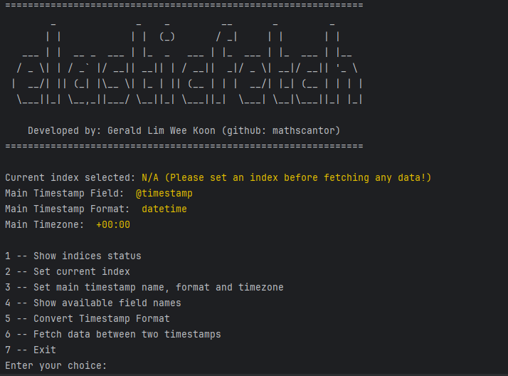
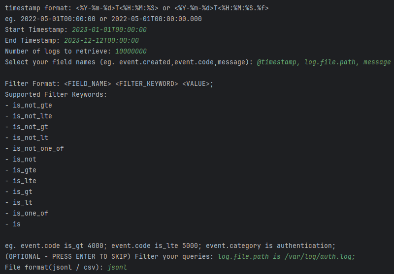
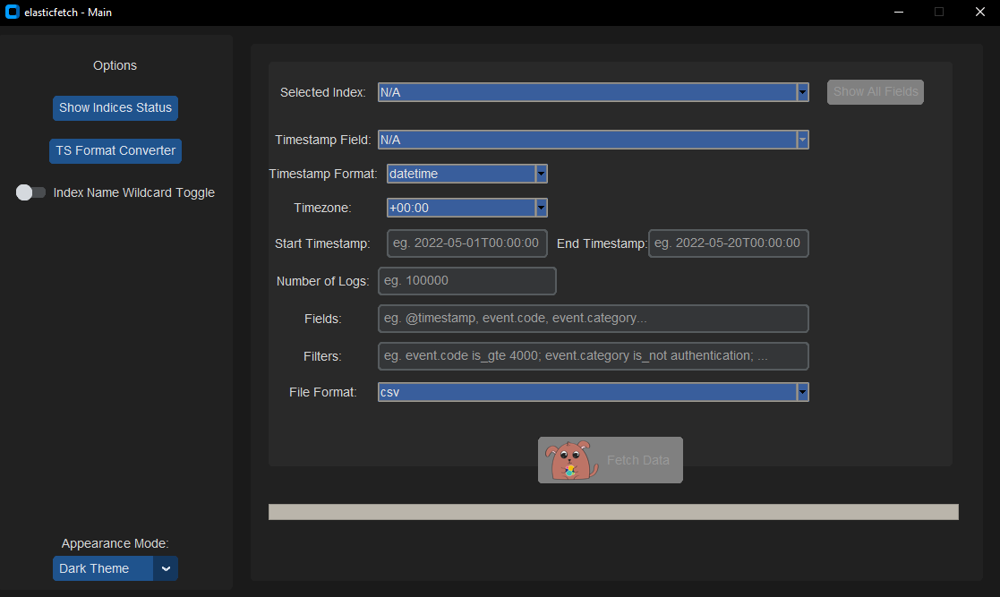
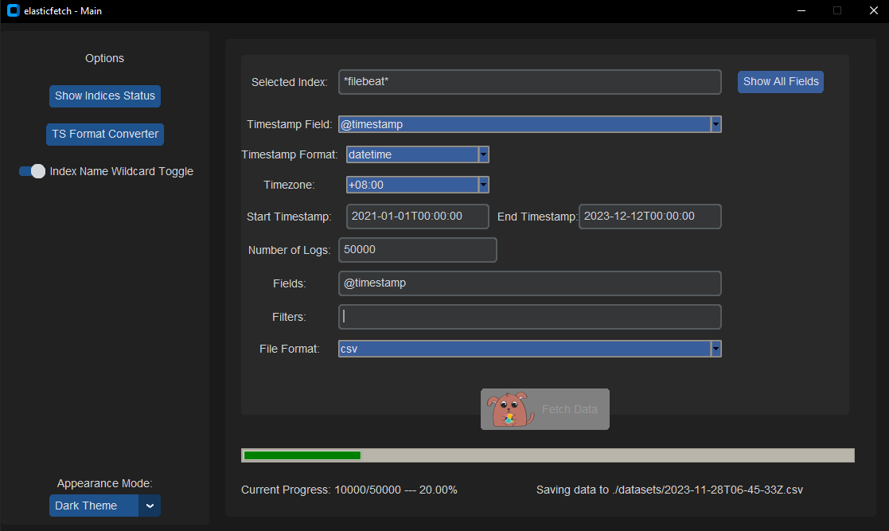

<p align="center" style="margin-bottom: 0px !important;">
  
</p>

# Elasticfetch
- [1. Overview](#1-overview)
- [2. Required Python Packages](#2-required-python-packages)
- [3. Current Features](#3-current-features)
    - [3.1. Supported Time Formats](#31-supported-time-formats)
    - [3.2. Supported Filters](#32-supported-filters)
    - [3.3. Supported File Formats](#33-supported-file-formats)
      - [3.3.1 CSV](#331-csv)
      - [3.3.2 JSONL](#332-jsonl)
- [4. Setting parameters in configuration file](#4-setting-parameters-in-configuration-file)
- [5. Running Elasticfetch (CLI)](#5-running-elasticfetch-cli)
    - [5.1. Show indices status](#51-show-indices-status)
    - [5.2. Set current index](#52-set-current-index)
    - [5.3. Set main timestamp, format and timezone](#53-set-main-timestamp-format-and-timezone)
    - [5.4. Listing all available fields within the current chosen index](#54-listing-all-available-fields-within-the-current-chosen-index)
    - [5.5. Converting datetime string to unix epoch](#55-converting-datetime-string-to-unix-epoch)
    - [5.6. Fetching data from a chosen index](#56-fetching-data-from-a-chosen-index)
- [6. Running Elasticfetch (GUI)](#6-running-elasticfetch-gui) 
## 1. Overview
Elasticfetch is a simple tool used to export huge amounts of data from elasticsearch. <br>

Currently, Elasticfetch is not reliant on the `scroll API` and therefore, will continue working on elasticsearch servers older than `version 7.7`. However, it is still recommended that you upgrade your elasticsearch to `version 8.x`

Elasticfetch facilitates the work flow for data analysts where the analyst need not request for the server admin to help pull data from elasticsearch.<br>
It has also been proven to be effective when deployed for threat hunting in multiple cyber military exercises.
## 2. Required Python Packages
```sh
# Necessary Python Packages 
pip3 install requests
pip3 install tqdm

# Additional Python Packages (For GUI)
# If you only plan to use the CLI version, you are not required to install the packages below. 
pip3 install tk
pip3 install customtkinter==5.2.1
pip3 install pillow
pip3 install packaging

# For Linux users, you need this additional packages
# Ubuntu or other distros with Apt:
sudo apt-get install python3-tk python3-pil python3-pil.imagetk

# For Fedora:
sudo dnf install python3-tkinter python3-pillow-tk

# For CentOS:
sudo yum install python3-tkinter python3-pillow

# For Arch Linux:
sudo pacman -S tk python-pillow

# For Red Hat:
sudo yum install python3-tkinter python3-pillow

# For openSUSE:
sudo zypper install python3-tk python3-pillow
```

## 3. Current Features
1. Show index health status
2. Setting Index to fetch from (Can Use Wildcard * too)
3. Set main timestamp name, format and timezone (This field will be used to sort your data in chronological order)
4. Showing available field names related to your index
5. Converting datetime to epoch / epoch to datetime format
6. Fetching data between two timestamps

### 3.1. Supported Time Formats
<div style="margin-left: auto;
            margin-right: auto;
            width: 70%">
<table>
  <tr>
   <td><b>Format</b>
   </td>
   <td><b>Supported Formats</b>
   </td>
   <td><b>Smallest Unit</b>
   </td>
   <td><b>Examples</b>
   </td>
  </tr>
  <tr>
   <td rowspan="2" >datetime
   </td>
   <td>&lt;%Y-%m-%d>T&lt;%H:%M:%S>
   </td>
   <td>seconds
   </td>
   <td>2022-05-01T00:00:00
   </td>
  </tr>
  <tr>
   <td>&lt;%Y-%m-%d>T&lt;%H:%M:%S.%f>
   </td>
   <td>milliseconds
   </td>
   <td>2022-05-01T00:00:00.000
   </td>
  </tr>
  <tr>
   <td rowspan="2" >epoch
   </td>
   <td>10 digit string
   </td>
   <td>seconds
   </td>
   <td>1420070400
   </td>
  </tr>
  <tr>
   <td>13 digit string
   </td>
   <td>milliseconds
   </td>
   <td>1420070400000
   </td>
  </tr>
</table>
</div>
<p align="center" style="margin-top: 0px;">Table 1. Supported time formats</p><br>

### 3.2. Supported Filters
Filter Syntax: `FIELD` `FILTER_KEYWORD` `VALUE;`

Current Supported Filter Keywords:

<div style="margin-left: auto;
            margin-right: auto;
            width: 65%">
<table>
    <tr>
        <td><b>Keyword</b></td>
        <td><b>Example</b></td>
        <td><b>Python Equivalent</b></td>
    </tr>
    <tr>
        <td>is_not_gte</td>
        <td>event.code is_not_gte 5000;</td>
        <td>event.code &lt; 5000</td>
    </tr>
    <tr>
        <td>is_not_lte</td>
        <td>event.code is_not_lte 4000;</td>
        <td>event.code &gt; 4000</td>
    </tr>
    <tr>
        <td>is_not_gt</td>
        <td>event.code is_not gt 5000;</td>
        <td>event.code &lt;= 5000</td>
    </tr>
    <tr>
        <td>is_not_lt</td>
        <td>event.code is_not_lt 4000;</td>
        <td>event.code &gt;= 4000</td>
    </tr>
    <tr>
        <td>is_not_one_of</td>
        <td>srcPort is_not_one_of 53,80,443;</td>
        <td>srcPort not in ['53', '80', '443']</td>
    </tr>
    <tr>
        <td>is_not</td>
        <td>srcIp is_not 127.0.0.1;</td>
        <td>srcIp != "127.0.0.1"</td>
    </tr>
    <tr>
        <td>is_gte</td>
        <td>event.code is_gte 5000;</td>
        <td>event.code &gt;= 5000</td>
    </tr>
    <tr>
        <td>is_lte</td>
        <td>event.code is_lte 4000;</td>
        <td>event.code &lt;= 4000</td>
    </tr>
    <tr>
        <td>is_gt</td>
        <td>event.code is_gt 5000;</td>
        <td>event.code &gt; 5000</td>
    </tr>
    <tr>
        <td>is_lt</td>
        <td>event.code is_lt 4000;</td>
        <td>event.code &lt; 4000</td>
    </tr>
    <tr>
        <td>is_one_of</td>
        <td>event.code is_one_of 1,2,3,4,5;</td>
        <td>event.code in ['1', '2', '3', '4', '5']</td>
    </tr>
    <tr>
        <td>is</td>
        <td>event.outcome is success;</td>
        <td>event.outcome == "success"</td>
    </tr>
</table>
</div>
<p align="center" style="margin-top: 0px;">Table 2. Supported Filter Keywords</p><br>


#### 3.2.1. Chaining Filters:
Example 1:
```python
# Python Equivlant
event.code in ['1', '2', '3', '4', '5', '6', '7', '8', '9', '10'] 
and event.outcome == "success"
```
<p align="center" style="margin-top: 0px;">Listing 1. Example 1 in Python</p>

```text
# Filters
event.code is_one_of 1,2,3,4,5,6,7,8,9,10; event.outcome is success;
```
<p align="center" style="margin-top: 0px;">Listing 2. Example 1 in Elasticfetch Filter Syntax</p>

Example 2: 
```python
# Python Equivlant
srcIp == "105.24.235.13" and dstPort not in ['53', '80', '443']
```
<p align="center" style="margin-top: 0px;">Listing 3. Example 2 in Python</p>

```text
# Filters
srcIp is 105.24.235.13; dstPort is_not_one_of 53,80,443;
```
<p align="center" style="margin-top: 0px;">Listing 4. Example 2 in Elasticfetch Filter Syntax</p>

### 3.3 Supported File Formats
Currently, I only support `csv` and `jsonl` file formats.

#### 3.3.1. CSV
To read the saved `csv` file, you can follow the example snippet:
```python
import pandas as pd

df = pd.read_csv("datasets/2023-11-28T06-29-43Z.csv")
```
<p align="center" style="margin-top: 0px;">Listing 5. Reading CSV Files</p>

#### 3.3.2. JSONL
To read the saved `jsonl` file, you can follow the example snippet:
```python
import json

f = open("datasets/2023-11-27T05-48-04Z.jsonl", "r")
for line in f:
    # Each line contains <batch_size configured in elasticfetch.ini> of data
    json_obj = json.loads(line)
    for i in range(len(json_obj["hits"]["hits"])):
        # Your code here
```
<p align="center" style="margin-top: 0px;">Listing 6. Reading JSONL Files</p>

## 4. Setting parameters in configuration file
Edit **elasticfetch.ini** and set the following variables to your values : <br>
- Protocol: `https` or `http`
- IP address: `XXX.XXX.XXX.XXX` or `domain name`
- Port: Default is `9200`
- Username: Must have *enough privilege* to use APIs
- Password 
- Graphical: `True` / `False`
- Batch Size: Default is `10000`


## 5. Running Elasticfetch CLI
Make sure to configure the graphical option under the interface section to be `False` before running **elasticfetch**.
```python
[interface]
# Default is False which uses CLI.
# Set this option to True if you want to use CLI
graphical = False
```
<p align="center" style="margin-top: 0px;">Listing 7. elasticfetch.ini for CLI</p>

```bash
python3 elasticfetch.py
```
<p align="center" style="margin-top: 0px;">Listing 8. Running Elasticfetch for CLI</p>

<p align="center" style="margin-bottom: 0px !important;">
  
</p>
<p align="center" style="margin-top: 0px;">Figure 1. CLI Main Menu</p>


### 5.1.  Show indices status
```text
health status index                                           uuid                   pri rep docs.count docs.deleted store.size pri.store.size
yellow open   .internal.alerts-security.alerts-default-000001 ######################   1   1       1094            0      3.7mb          3.7mb
yellow open   .internal.alerts-security.alerts-default-000002 ######################   1   1        213            0      1.5mb          1.5mb
yellow open   .internal.alerts-security.alerts-default-000003 ######################   1   1        264            0      1.5mb          1.5mb
yellow open   .internal.alerts-security.alerts-default-000004 ######################   1   1        237            0      2.2mb          2.2mb
yellow open   .internal.alerts-security.alerts-default-000005 ######################   1   1         33            0    614.5kb        614.5kb
yellow open   .items-default-000001                           ######################   1   1          0            0       225b           225b
yellow open   .lists-default-000001                           ######################   1   1          0            0       225b           225b
yellow open   auditbeat-8.0.1                                 ######################   1   1   40024180            0     25.9gb         25.9gb
yellow open   auditbeat-8.1.0                                 ######################   1   1   12285275            0      7.9gb          7.9gb
yellow open   auditbeat-8.1.2                                 ######################   1   1    4298254            0      3.1gb          3.1gb
yellow open   filebeat-7.15.2-2022.03.11-000001               ######################   1   1       1008            0    455.6kb        455.6kb
yellow open   filebeat-7.15.2-2022.04.10-000002               ######################   1   1          0            0       225b           225b
yellow open   filebeat-7.15.2-2022.05.10-000003               ######################   1   1          0            0       225b           225b
yellow open   filebeat-7.15.2-2022.06.09-000004               ######################   1   1          0            0       225b           225b
yellow open   filebeat-7.15.2-2022.07.09-000005               ######################   1   1          0            0       225b           225b
yellow open   filebeat-8.0.1                                  ######################   1   1   15815910            0        9gb            9gb
yellow open   filebeat-8.1.0                                  ######################   1   1   22087647            0     13.6gb         13.6gb
yellow open   filebeat-8.1.2                                  ######################   1   1    6655497            0      4.1gb          4.1gb
green  open   metrics-endpoint.metadata_current_default       ######################   1   0          0            0       225b           225b
yellow open   packetbeat-8.0.1                                ######################   1   1  215773987            0     92.1gb         92.1gb
yellow open   packetbeat-8.1.0                                ######################   1   1   21195763            0      9.8gb          9.8gb
yellow open   packetbeat-8.1.2                                ######################   1   1   52814104            0     20.8gb         20.8gb
yellow open   winlogbeat-8.0.1                                ######################   1   1  102336389            0    103.9gb        103.9gb
```
<p align="center" style="margin-top: 0px;">Listing 9. Displaying Indices Status & Statistics</p>

### 5.2. Set current index

**NEW FEATURE** for elasticfetch **v4.0.0**: Wildcard Usage

The wildcard (*) allows you to match multiple indices so that you can 
fetch your data from all the indices that match it. There was a need for this
as it is common to rotate your index either daily or when it hits a threshold size.
To make it easy for users to pull from multiple index sources all at once, this feature
has been introduced.

In the example below, I have used `*filebeat*` to match with:
- filebeat-7.15.2-2022.03.11-000001
- filebeat-7.15.2-2022.04.10-000002
- filebeat-7.15.2-2022.05.10-000003
- filebeat-7.15.2-2022.06.09-000004
- filebeat-7.15.2-2022.07.09-000005

```text
Listing all beats indices:

0 -- Custom Index Name (Wildcard * available for use)
1 -- .internal.alerts-security.alerts-default-000001
2 -- .internal.alerts-security.alerts-default-000002
3 -- .internal.alerts-security.alerts-default-000003
4 -- .internal.alerts-security.alerts-default-000004
5 -- .internal.alerts-security.alerts-default-000005
6 -- .items-default-000001
7 -- .lists-default-000001
8 -- auditbeat-8.0.1
9 -- auditbeat-8.1.0
10 -- auditbeat-8.1.2
11 -- filebeat-7.15.2-2022.03.11-000001
12 -- filebeat-7.15.2-2022.04.10-000002
13 -- filebeat-7.15.2-2022.05.10-000003
14 -- filebeat-7.15.2-2022.06.09-000004
15 -- filebeat-7.15.2-2022.07.09-000005

Enter your index choice: 0                      ← (Your input)
Enter your custom index name: *filebeat*        ← (Your input)
```
<p align="center" style="margin-top: 0px;">Listing 10. Example of Wildcard Usage to Select Multiple Indices</p>

### 5.3. Set main timestamp, format and timezone

The main timestamp field name will be used in sorting the timestamps in ascending order. 
Option 3 allows you to set a new main timestamp field name from the displayed 'ALL RELATED FIELDS' column. 

In this example, option 3 will show you all related fields that are of 'date' type.
The default main timestamp field is @timestamp as elasticsearch uses 
this field universally for referencing time.

However, I am aware that certain users / organization do 
rename '@timestamp' to something else. Therefore, I have added this feature to
support existing organizations that require this. <br>

```text
 [INFO] Retrieved available fields for index: .internal.alerts-ml.anomaly-detection.alerts-default-000001

TOP LEVEL PARENT               TYPE       ALL RELATED FIELDS            
----------------               ----       ------------------            
@timestamp                     date       @timestamp                    

kibana                         date       kibana.alert.top_records.timestamp, kibana.alert.anomaly_timestamp, ...
.
.
.

Main Timestamp Name: @timestamp        ← (Your input)
Main Timestamp Format: datetime        ← (Your input)
Main Timezone: +08:00                  ← (Your input)
```
<p align="center" style="margin-top: 0px;">Listing 11. Example of Setting Timestamp, Format & Timezone</p>


### 5.4. Listing all available fields within the current chosen index
It is a known grievance that the users have to manually check what fields are available to them. 

Option 4 allows users to list the whole shebang of fields.
```text
 [INFO] Retrieved available fields for index: .internal.alerts-ml.anomaly-detection.alerts-default-000001

TOP LEVEL PARENT               TYPE                 ALL RELATED FIELDS            
----------------               ----                 ------------------            
@timestamp                     date                 @timestamp                    

_data_stream_timestamp         NoType               _data_stream_timestamp        

_doc_count                     NoType               _doc_count                    

_feature                       NoType               _feature     
   
_version                       NoType               _version                      

event                          keyword              event.action, event.kind      

kibana                         keyword              kibana.alert.top_records.job_id, kibana.alert.rule.uuid ...
                               double               kibana.alert.top_records.actual, kibana.alert.anomaly_score ...
                               date                 kibana.alert.top_records.timestamp, kibana.alert.anomaly_timestamp ...
                               long                 kibana.alert.rule.revision, kibana.alert.duration.us
.
.
.
```
<p align="center" style="margin-top: 0px;">Listing 12. Displaying All Available Fields Associated to Index / Indices</p>

### 5.5. Converting datetime string to unix epoch
This takes into account of your current timezone when converting to epoch time.
```text
Enter your choice: 5

1 -- Convert datetime to epoch
2 -- Convert epoch to datetime
```
<p align="center" style="margin-top: 0px;">Listing 13. Menu for Timestamp Format Conversion</p>

Converting datetime to epoch
```text
timestamp format: <%Y-%m-%d>T<%H:%M:%S> or <%Y-%m-%d>T<%H:%M:%S.%f>
eg. 2022-05-01T00:00:00 or 2022-05-01T00:00:00.000
Start Timestamp: 2022-05-01T00:00:00            ← (Your input)
End Timestamp: 2022-05-20T00:00:00              ← (Your input)
Timezone: +08:00                                ← (Your input)
Epoch Range: 1651334400000 - 1652976000000
```
<p align="center" style="margin-top: 0px;">Listing 14. DateTime to Epoch Conversion</p>

Converting epoch to datetime
```text
timestamp format: <10 / 13 digit string>
eg. 1420070400 or 1420070400001
Start Timestamp: 1651334400000                  ← (Your input)
End Timestamp: 1652976000000                    ← (Your input)
Timezone: +08:00                                ← (Your input)
Datetime Range: 2022-05-01T00:00:00.000 - 2022-05-20T00:00:00.000
```
<p align="center" style="margin-top: 0px;">Listing 15. Epoch to DateTime Conversion</p>

### 5.6. Fetching data from a chosen index

This will prompt you for:
- Start and End Timestamps (See [Supported Time Formats](#supported-time-formats))
- Number of Logs
- Filed Names
- Filters (See [Supported Filters](#supported-filters))
- File Format (Either `jsonl` or `csv`)


<p align="center" style="margin-bottom: 0px !important;">
  
</p>
<p align="center" style="margin-top: 0px;">Figure 2. Data Fetch Example</p><br>

## 6. Running Elasticfetch GUI
Make sure to configure the graphical option under the interface section to be `True` before running **elasticfetch**.
```python
[interface]
# Default is False which uses CLI.
# Set this option to True if you want to use CLI
graphical = True
```
<p align="center" style="margin-top: 0px;">Listing 16. elasticfetch.ini for GUI</p>

```sh
python3 elasticfetch.py
```
<p align="center" style="margin-top: 0px;">Listing 17. Running for Elasticfetch GUI</p>

Just like the CLI, the GUI provides the same utilities.
<p align="center" style="margin-bottom: 0px !important;">
  
</p>
<p align="center" style="margin-top: 0px;">Figure 3. GUI Main Menu</p><br>

Fill in the appropriate fields and click on the "Fetch Data" Button.<br>
(See [Supported Filters](#supported-filters)) <br>
(See [Supported Time Formats](#supported-time-formats))<br>

<p align="center" style="margin-bottom: 0px !important;">
  
</p>
<p align="center" style="margin-top: 0px;">Figure 4. GUI Fetch Data Example</p><br>

Other Quality-Of-Life features include looking up the available field names, whilst being able to cycle through your search terms.
<p align="center" style="margin-bottom: 0px !important;">
  
</p>
<p align="center" style="margin-top: 0px;">Figure 5. GUI Show Available Fields</p><br>

In addition, if there is a need to convert datetime to epoch or vice-versa, there is also the timestamp format converter readily available at your disposal!
<p align="center" style="margin-bottom: 0px !important;">
  
</p>
<p align="center" style="margin-top: 0px;">Figure 6. Timestamp Format Converter GUI</p><br>

