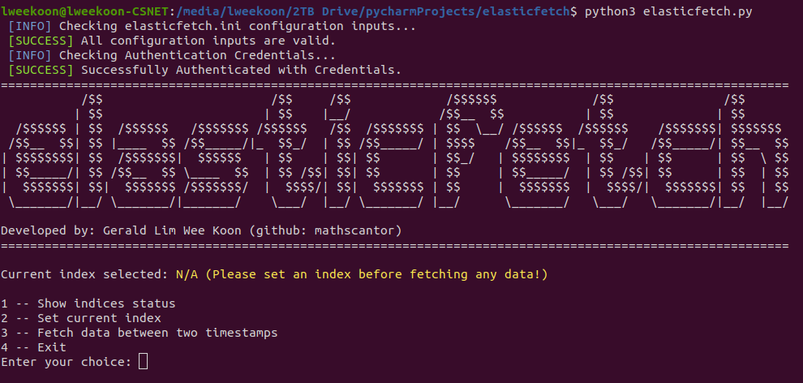
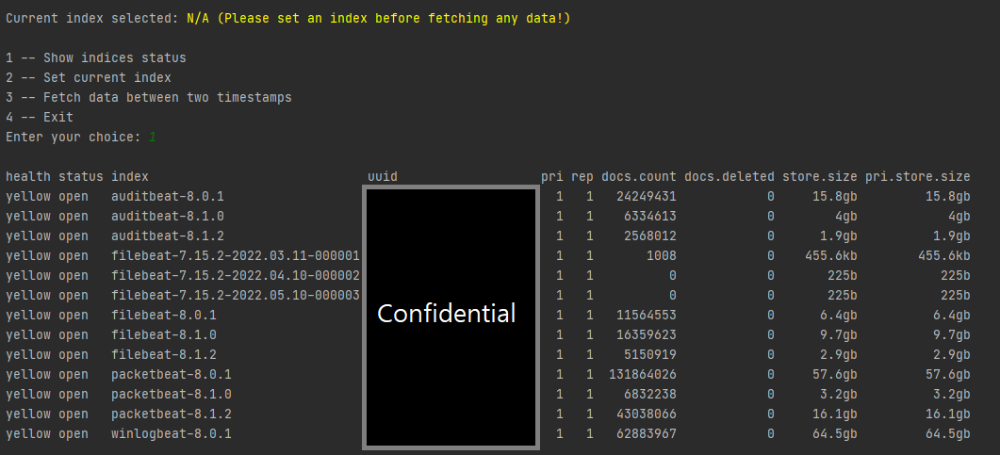
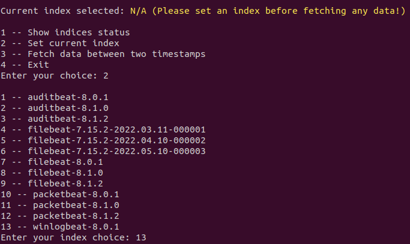
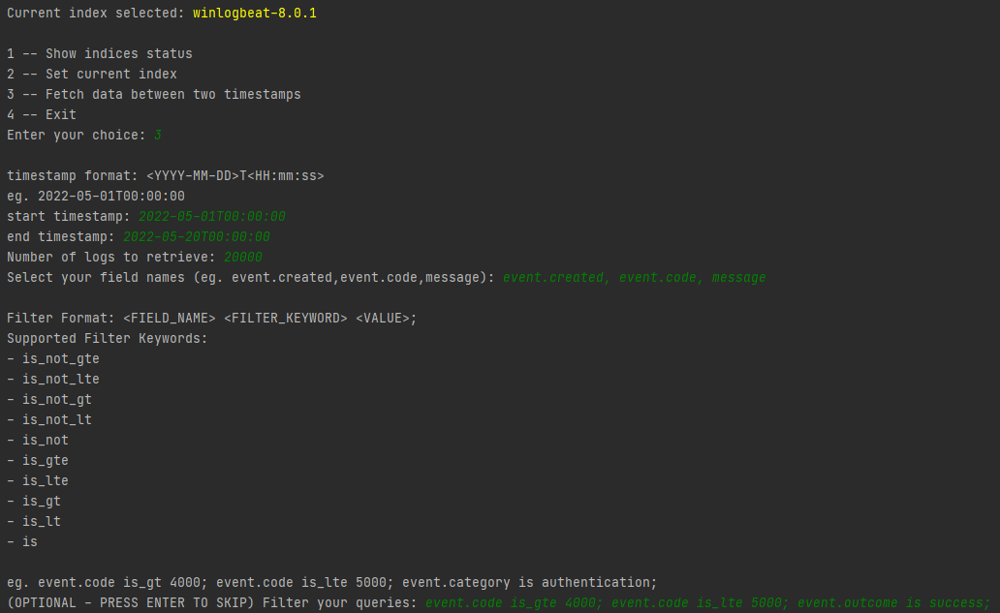
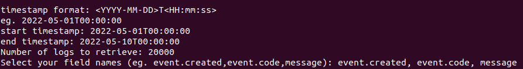
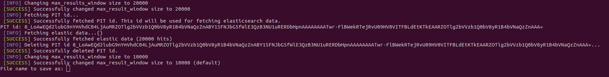

# elasticfetch
Elasticfetch is a simple tool to fetch more than 10,000 data entries from elasticsearch. <br />
Fetching data out of elasticsearch is tough but there are numerous workarounds with their APIs. <br />
However, it is a rather manual process to do CURL commands each time you need to fetch some data. <br />
Thus, this tool helps to eliminate the tedious process of getting data out of elasticsearch.

## Required Python Packages
```sh
pip3 install requests
```

## Current Features
1. Show index health status
2. Setting Index to fetch from
3. Fetching data between timestamps

## How to use
### Step 1 - Setting parameters in configuration file
Edit **elasticfetch.ini** and set it to the correct : <br />
- IP address 
- port (Usually, it is 9200)
- username 
- password 

### Step 2 - Running elasticfetch
```sh
python3 elasticfetch.py
```


### Step 3 (Optional) - Listing indices status


### Step 4 - Choosing your index to get data from.
 <br />
In the above example, I have chosen the winlogbeat-8.0.1 index.
Once you have chosen your index, it will be shown that you are fetching from that particular index
### Step 5 - Fetching data from a chosen index.
Select option 3 in the main menu. <br />
 <br />
This will prompt you for:
- start timestamp
- end timestamp
- number of logs you want to fetch in this time period.
- field names to select (Look at kibana dashboard to know what is available)
- filtering your queries by specifying (FIELD FILTER_KEYWORD VALUE;)

Current Supported Filter Keywords:
- is_not_gte
- is_not_lte
- is_not_gt
- is_not_lt
- is_not
- is_gte
- is_lte
- is_gt
- is_lt
- is

 <br />
A successful fetch would result in the following success messages.<br />
Elasticfetch will also print the following JSON object sent to your elasticsearch just so that you know what requests you are sending.

```sh
[INFO] Sending the following request:
GET https://127.0.0.1:9200/_search?pretty
{
    "size": 20000,
    "_source": [
        "event.created",
        "event.code",
        "message"
    ],
    "query": {
        "bool": {
            "filter": [
                {
                    "range": {
                        "@timestamp": {
                            "gte": "2022-05-01T00:00:00",
                            "lte": "2022-05-20T00:00:00"
                        }
                    }
                }
            ],
            "must": [
                {
                    "term": {
                        "event.outcome": "success"
                    }
                },
                {
                    "range": {
                        "event.code": {
                            "gte": "4000"
                        }
                    }
                },
                {
                    "range": {
                        "event.code": {
                            "lte": "5000"
                        }
                    }
                }
            ]
        }
    },
    "pit": {
        "id": "8_LoAwEQd2lubG9nYmVhdC04LjAuMRZOTlg2bVVzb1Q0bV8yR1B4bVNaQzZnABY1SFNJbG5fWlE3QzB3NU1uRERDbHpnAAAAAAAAfSB2FlBWekRTejRvU09HV0VITFBLdEtKTkEAARZOTlg2bVVzb1Q0bV8yR1B4bVNaQzZnAAA=",
        "keep_alive": "60m"
    },
    "sort": [
        {
            "@timestamp": {
                "order": "asc",
                "format": "strict_date_optional_time_nanos",
                "numeric_type": "date_nanos"
            }
        }
    ]
}
```
 <br />
At the end, it will prompt you for a file name to dump the data in (Currently only support .json, .csv). <br />
All saved files will be found under the **datasets** folder


