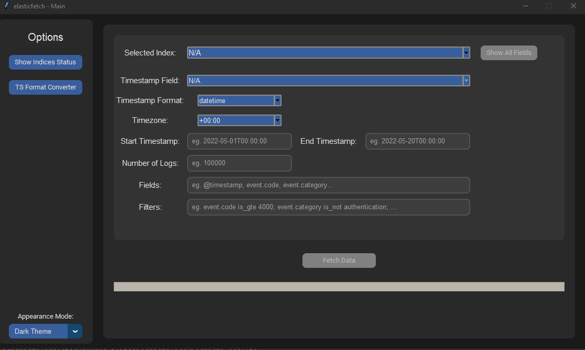
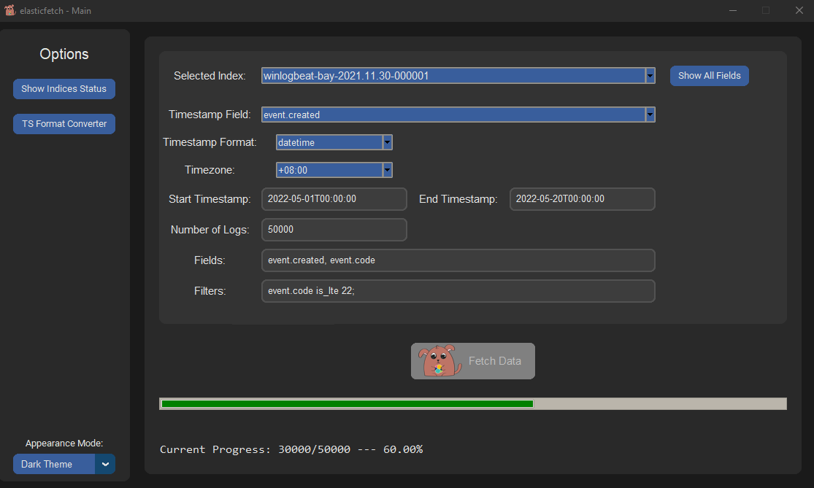
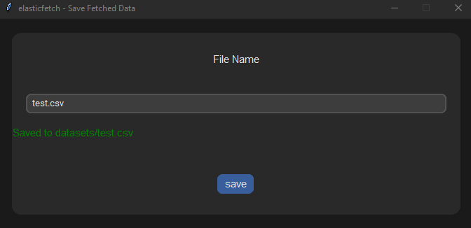
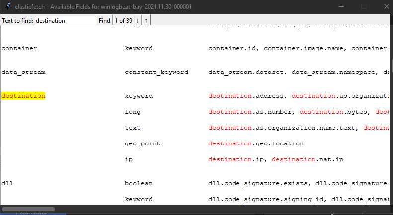
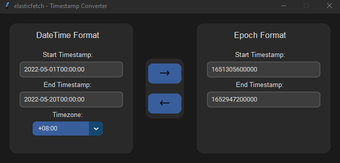

<p align="center" style="margin-bottom: 0px !important;">
  
</p>

# Elasticfetch
- [Overview](#overview)
- [Required Python Packages](#required-python-packages)
- [Current Features](#current-features)
    - [Supported Time Formats](#supported-time-formats)
    - [Supported Filters](#supported-filters)
- [Setting parameters in configuration file](#setting-parameters-in-configuration-file)
- [Running elasticfetch (CLI)](#running-elasticfetch-cli)
    - [Option 1 - Show indices status](#option-1---show-indices-status)
    - [Option 2 - Set current index](#option-2---set-current-index)
    - [Option 3 - Set main timestamp, format and timezone](#option-3---set-main-timestamp-format-and-timezone)
    - [Option 4 - Listing all available fields within the current chosen index](#option-4---listing-all-available-fields-within-the-current-chosen-index)
    - [Option 5 - Converting datetime string to unix epoch](#option-5---converting-datetime-string-to-unix-epoch)
    - [Option 6 - Fetching data from a chosen index](#option-6---fetching-data-from-a-chosen-index)
- [Running elasticfetch (GUI)](#running-elasticfetch-gui) 
## Overview
Elasticfetch is a simple tool used to export huge amounts of data from elasticsearch. <br>

Currently, Elasticfetch is not reliant on the `scroll API` and therefore, will continue working on elasticsearch servers older than `version 7.7`. However, it is still recommended that you upgrade your elasticsearch to `version 8.x`

Elasticfetch facilitates the work flow for data analysts where the analyst need not request for the server admin to help pull data from elasticsearch.<br>
It has also been proven to be effective when deployed for threat hunting in multiple cyber military exercises.
## Required Python Packages
```sh
pip3 install requests
pip3 install tqdm
pip3 install tk
pip3 install customtkinter==4.6.3
```

## Current Features
1. Show index health status
2. Setting Index to fetch from
3. Set main timestamp name, format and timezone (This field will be used to sort your data in chronological order)
4. Showing available field names related to your index (**Not Hardcoded**)
5. Converting datetime to epoch / epoch to datetime format
6. Fetching data between two timestamps

### Supported Time Formats
<table>
  <tr>
   <td><b>Format</b>
   </td>
   <td><b>Supported Formats</b>
   </td>
   <td><b>Smallest Unit</b>
   </td>
   <td><b>Examples</b>
   </td>
  </tr>
  <tr>
   <td rowspan="2" >datetime
   </td>
   <td>&lt;%Y-%m-%d>T&lt;%H:%M:%S>
   </td>
   <td>seconds
   </td>
   <td>2022-05-01T00:00:00
   </td>
  </tr>
  <tr>
   <td>&lt;%Y-%m-%d>T&lt;%H:%M:%S.%f>
   </td>
   <td>milliseconds
   </td>
   <td>2022-05-01T00:00:00.000
   </td>
  </tr>
  <tr>
   <td rowspan="2" >epoch
   </td>
   <td>10 digit string
   </td>
   <td>seconds
   </td>
   <td>1420070400
   </td>
  </tr>
  <tr>
   <td>13 digit string
   </td>
   <td>milliseconds
   </td>
   <td>1420070400000
   </td>
  </tr>
</table>

### Supported Filters
Filter Syntax: `FIELD` `FILTER_KEYWORD` `VALUE;`

Current Supported Filter Keywords:

<table>
    <tr>
        <td><b>Keyword</b></td>
        <td><b>Example</b></td>
        <td><b>Python Equivalent</b></td>
    </tr>
    <tr>
        <td>is_not_gte</td>
        <td>event.code is_not_gte 5000;</td>
        <td>event.code &lt; 5000</td>
    </tr>
    <tr>
        <td>is_not_lte</td>
        <td>event.code is_not_lte 4000;</td>
        <td>event.code &gt; 4000</td>
    </tr>
    <tr>
        <td>is_not_gt</td>
        <td>event.code is_not gt 5000;</td>
        <td>event.code &lt;= 5000</td>
    </tr>
    <tr>
        <td>is_not_lt</td>
        <td>event.code is_not_lt 4000;</td>
        <td>event.code &gt;= 4000</td>
    </tr>
    <tr>
        <td>is_not_one_of</td>
        <td>srcPort is_not_one_of 53,80,443;</td>
        <td>srcPort not in ['53', '80', '443']</td>
    </tr>
    <tr>
        <td>is_not</td>
        <td>srcIp is_not 127.0.0.1;</td>
        <td>srcIp != "127.0.0.1"</td>
    </tr>
    <tr>
        <td>is_gte</td>
        <td>event.code is_gte 5000;</td>
        <td>event.code &gt;= 5000</td>
    </tr>
    <tr>
        <td>is_lte</td>
        <td>event.code is_lte 4000;</td>
        <td>event.code &lt;= 4000</td>
    </tr>
    <tr>
        <td>is_gt</td>
        <td>event.code is_gt 5000;</td>
        <td>event.code &gt; 5000</td>
    </tr>
    <tr>
        <td>is_lt</td>
        <td>event.code is_lt 4000;</td>
        <td>event.code &lt; 4000</td>
    </tr>
    <tr>
        <td>is_one_of</td>
        <td>event.code is_one_of 1,2,3,4,5;</td>
        <td>event.code in ['1', '2', '3', '4', '5']</td>
    </tr>
    <tr>
        <td>is</td>
        <td>event.outcome is success;</td>
        <td>event.outcome == "success"</td>
    </tr>
</table>

#### Chaining Filters:
Example 1: <br>
```python
# Python Equivlant
event.code in ['1', '2', '3', '4', '5', '6', '7', '8', '9', '10'] 
and event.outcome == "success"
```
```python
# Filters
event.code is_one_of 1,2,3,4,5,6,7,8,9,10; event.outcome is success;
```

Example 2: 
```python
# Python Equivlant
srcIp == "105.24.235.13" and dstPort not in ['53', '80', '443']
```
```python
# Filters
srcIp is 105.24.235.13; dstPort is_not_one_of 53,80,443;
```

## Setting parameters in configuration file
Edit **elasticfetch.ini** and set the following variables to your values : <br>
- Protocol (`https` or `http`)
- IP address (`XXX.XXX.XXX.XXX` or `domain name`)
- port (Usually `9200`)
- username (Must have *enough privilege* to use APIs)
- password 
- graphical (`True` / `False`) 


## Running elasticfetch (CLI)
```sh
python3 elasticfetch.py
```
```text
===============================================================
        _              _    _         __       _         _     
       | |            | |  (_)       / _|     | |       | |    
   ___ | |  __ _  ___ | |_  _   ___ | |_  ___ | |_  ___ | |__  
  / _ \| | / _` |/ __|| __|| | / __||  _|/ _ \| __|/ __|| '_ \ 
 |  __/| || (_| |\__ \| |_ | || (__ | | |  __/| |_| (__ | | | |
  \___||_| \__,_||___/ \__||_| \___||_|  \___| \__|\___||_| |_|

    Developed by: Gerald Lim Wee Koon (github: mathscantor)    
===============================================================

Current index selected: N/A (Please set an index before fetching any data!)
Main Timestamp Field:  @timestamp
Main Timestamp Format:  datetime
Main Timezone:  +00:00

1 -- Show indices status
2 -- Set current index
3 -- Set main timestamp name, format and timezone
4 -- Show available field names
5 -- Convert Timestamp Format
6 -- Fetch data between two timestamps
7 -- Exit
```

### Option 1 - Show indices status
```text
health status index                                           uuid                   pri rep docs.count docs.deleted store.size pri.store.size
yellow open   .internal.alerts-security.alerts-default-000001 ######################   1   1       1094            0      3.7mb          3.7mb
yellow open   .internal.alerts-security.alerts-default-000002 ######################   1   1        213            0      1.5mb          1.5mb
yellow open   .internal.alerts-security.alerts-default-000003 ######################   1   1        264            0      1.5mb          1.5mb
yellow open   .internal.alerts-security.alerts-default-000004 ######################   1   1        237            0      2.2mb          2.2mb
yellow open   .internal.alerts-security.alerts-default-000005 ######################   1   1         33            0    614.5kb        614.5kb
yellow open   .items-default-000001                           ######################   1   1          0            0       225b           225b
yellow open   .lists-default-000001                           ######################   1   1          0            0       225b           225b
yellow open   auditbeat-8.0.1                                 ######################   1   1   40024180            0     25.9gb         25.9gb
yellow open   auditbeat-8.1.0                                 ######################   1   1   12285275            0      7.9gb          7.9gb
yellow open   auditbeat-8.1.2                                 ######################   1   1    4298254            0      3.1gb          3.1gb
yellow open   filebeat-7.15.2-2022.03.11-000001               ######################   1   1       1008            0    455.6kb        455.6kb
yellow open   filebeat-7.15.2-2022.04.10-000002               ######################   1   1          0            0       225b           225b
yellow open   filebeat-7.15.2-2022.05.10-000003               ######################   1   1          0            0       225b           225b
yellow open   filebeat-7.15.2-2022.06.09-000004               ######################   1   1          0            0       225b           225b
yellow open   filebeat-7.15.2-2022.07.09-000005               ######################   1   1          0            0       225b           225b
yellow open   filebeat-8.0.1                                  ######################   1   1   15815910            0        9gb            9gb
yellow open   filebeat-8.1.0                                  ######################   1   1   22087647            0     13.6gb         13.6gb
yellow open   filebeat-8.1.2                                  ######################   1   1    6655497            0      4.1gb          4.1gb
green  open   metrics-endpoint.metadata_current_default       ######################   1   0          0            0       225b           225b
yellow open   packetbeat-8.0.1                                ######################   1   1  215773987            0     92.1gb         92.1gb
yellow open   packetbeat-8.1.0                                ######################   1   1   21195763            0      9.8gb          9.8gb
yellow open   packetbeat-8.1.2                                ######################   1   1   52814104            0     20.8gb         20.8gb
yellow open   winlogbeat-8.0.1                                ######################   1   1  102336389            0    103.9gb        103.9gb
```

### Option 2 - Set current index
```text
Listing all beats indices:

1 -- .internal.alerts-security.alerts-default-000001
2 -- .internal.alerts-security.alerts-default-000002
3 -- .internal.alerts-security.alerts-default-000003
4 -- .internal.alerts-security.alerts-default-000004
5 -- .internal.alerts-security.alerts-default-000005
6 -- .items-default-000001
7 -- .lists-default-000001
8 -- auditbeat-8.0.1
9 -- auditbeat-8.1.0
10 -- auditbeat-8.1.2
11 -- filebeat-7.15.2-2022.03.11-000001
12 -- filebeat-7.15.2-2022.04.10-000002
13 -- filebeat-7.15.2-2022.05.10-000003
14 -- filebeat-7.15.2-2022.06.09-000004
15 -- filebeat-7.15.2-2022.07.09-000005
16 -- filebeat-8.0.1
17 -- filebeat-8.1.0
18 -- filebeat-8.1.2
19 -- metrics-endpoint.metadata_current_default
20 -- packetbeat-8.0.1
21 -- packetbeat-8.1.0
22 -- packetbeat-8.1.2
23 -- winlogbeat-8.0.1

Enter your index choice: 23
```
In the above example, I have chosen the winlogbeat-8.0.1 index.
Once you have chosen your index, it will be shown that you are fetching from that particular index

### Option 3 - Set main timestamp, format and timezone

The main timestamp field name will be used in sorting the timestamps in ascending order. 
Option 3 allows you to set a new main timestamp field name from the displayed 'ALL RELATED FIELDS' column.
```text
 [SUCCESS] Showing available fields...


TOP LEVEL PARENT               TYPE       ALL RELATED FIELDS            
----------------               ----       ------------------            
@timestamp                     date       @timestamp                    

event                          date       event.created, event.ingested 

winlog                         date       winlog.event_data.ClientCreationTime, winlog.event_data.DeviceTime, winlog.event_data.NewTime, winlog.event_data.OldTime, winlog.event_data.ProcessCreationTime, winlog.event_data.StartTime, winlog.event_data.StopTime, winlog.user_data.UTCStartTime

Main Timestamp Name: @timestamp        ← (Your input)
Main Timestamp Format: datetime        ← (Your input)
Main Timezone: +08:00                  ← (Your input)
```
In this example, option 3 will show you all related fields that are of 'date' type. <br>

The default main timestamp field is @timestamp as elasticsearch uses this field universally for referencing time. <br>

However, I am aware that certain users / organization do rename '@timestamp' to something else. Therefore, I have added this feature to support existing organizations that require this. <br>

### Option 4 - Listing all available fields within the current chosen index
It is a known grievance that the users have to manually check what fields are available to them. Option 4 allows users to list the whole shebang of fields.
```text
[SUCCESS] Showing available fields...


TOP LEVEL PARENT               TYPE       ALL RELATED FIELDS            
----------------               ----       ------------------            
@timestamp                     date       @timestamp                    

_data_stream_timestamp         NoType     _data_stream_timestamp        

_doc_count                     NoType     _doc_count                    

_feature                       NoType     _feature                      

_field_names                   NoType     _field_names

file                           text       file.code_signature.status, file.code_signature.subject_name, file.directory, file.extension, file.hash.md5, file.hash.sha256, file.name, file.path, file.pe.imphash
                               keyword    file.code_signature.status.keyword, file.code_signature.subject_name.keyword, file.directory.keyword, file.extension.keyword, file.hash.md5.keyword, file.hash.sha256.keyword, file.name.keyword, file.path.keyword, file.pe.imphash.keyword
                               boolean    file.code_signature.valid     

group                          text       group.domain, group.id, group.name
                               keyword    group.domain.keyword, group.id.keyword, group.name.keyword

host                           text       host.architecture, host.hostname, host.id, host.ip, host.mac, host.name, host.os.build, host.os.family, host.os.kernel, host.os.name, host.os.platform, host.os.type, host.os.version
                               keyword    host.architecture.keyword, host.hostname.keyword, host.id.keyword, host.ip.keyword, host.mac.keyword, host.name.keyword, host.os.build.keyword, host.os.family.keyword, host.os.kernel.keyword, host.os.name.keyword, host.os.platform.keyword, host.os.type.keyword, host.os.version.keyword
.
.
.
```

### Option 5 - Converting datetime string to unix epoch
This takes into account of your current timezone when converting to epoch time.
```text
Enter your choice: 5

1 -- Convert datetime to epoch
2 -- Convert epoch to datetime
```
Converting datetime to epoch
```text
timestamp format: <%Y-%m-%d>T<%H:%M:%S> or <%Y-%m-%d>T<%H:%M:%S.%f>
eg. 2022-05-01T00:00:00 or 2022-05-01T00:00:00.000
Start Timestamp: 2022-05-01T00:00:00            ← (Your input)
End Timestamp: 2022-05-20T00:00:00              ← (Your input)
Timezone: +08:00                                ← (Your input)
Epoch Range: 1651334400000 - 1652976000000
```
Converting epoch to datetime
```text
timestamp format: <10 / 13 digit string>
eg. 1420070400 or 1420070400001
Start Timestamp: 1651334400000                  ← (Your input)
End Timestamp: 1652976000000                    ← (Your input)
Timezone: +08:00                                ← (Your input)
Datetime Range: 2022-05-01T00:00:00.000 - 2022-05-20T00:00:00.000
```

### Option 6 - Fetching data from a chosen index
```text
Current index selected: winlogbeat-8.0.1
Main Timestamp Field:  @timestamp
Main Timestamp Type:  datetime
Main Timezone: +08:00

1 -- Show indices status
2 -- Set current index
3 -- Set main timestamp name, format and timezone
4 -- Show available field names
5 -- Convert Timestamp Format
6 -- Fetch data between two timestamps
7 -- Exit
Enter your choice: 5                                                                                ← (Your input)

timestamp format: <%Y-%m-%d>T<%H:%M:%S> or <%Y-%m-%d>T<%H:%M:%S.%f>
eg. 2022-05-01T00:00:00 or 2022-05-01T00:00:00.000
Start Timestamp: 2022-05-01T00:00:00                                                                ← (Your input)
End Timestamp: 2022-05-20T00:00:00                                                                  ← (Your input)
Number of logs to retrieve: 50000                                                                   ← (Your input)
Select your field names (eg. event.created,event.code,message): event.created, event.code, message  ← (Your input)

Filter Format: <FIELD_NAME> <FILTER_KEYWORD> <VALUE>;
Supported Filter Keywords:
- is_not_gte
- is_not_lte
- is_not_gt
- is_not_lt
- is_not_one_of
- is_not
- is_gte
- is_lte
- is_gt
- is_lt
- is_one_of
- is

eg. event.code is_gt 4000; event.code is_lte 5000; event.category is authentication;                ← (Your input)
(OPTIONAL - PRESS ENTER TO SKIP) Filter your queries: event.code is_gte 1000;
 [INFO] Fetching elastic data...
Fetch Progress: 100%|██████████| 50000/50000 [01:26<00:00, 577.40it/s]
 [SUCCESS] Successfully fetched 50000 data entries!
File name to save as (.json, .csv): test.csv                                                        ← (Your input)
 [INFO] Saving data to datasets/test.csv
 [SUCCESS] Successfully saved data to datasets/test.csv

```
This will prompt you for:
- start and end timestamps (See [Supported Time Formats](#supported-time-formats))
- number of logs you want to fetch in this time period.
- field names
- filters (See [Supported Filters](#supported-filters))

At the end, it will prompt you for a file name to dump the data in (Currently only support .json, .csv). <br />
All saved files will be found under the **datasets** folder

### Running elasticfetch (GUI)
```sh
python3 elasticfetch.py
```
Just like the CLI, the GUI provides the same utilities.
<p align="center" style="margin-bottom: 0px !important;">
  
</p>
<p align="center" style="margin-top: 0px;">Figure 1. Main Menu GUI</p><br>

Fill in the appropriate fields and click on the "Fetch Data" Button.<br>
(See [Supported Filters](#supported-filters)) <br>
(See [Supported Time Formats](#supported-time-formats))<br>

<p align="center" style="margin-bottom: 0px !important;">
  
</p>
<p align="center" style="margin-top: 0px;">Figure 2. Fetching Data GUI</p><br>

Once you have finished fetching the data, there will be a pop-up window, prompting you to save your data as a .csv or .json file.
<p align="center" style="margin-bottom: 0px !important;">
  
</p>
<p align="center" style="margin-top: 0px;">Figure 3. Saving Data GUI</p><br>

Other Quality-Of-Life features include looking up the available field names, whilst being able to cycle through your search terms.
<p align="center" style="margin-bottom: 0px !important;">
  
</p>
<p align="center" style="margin-top: 0px;">Figure 4. Show Available Fields GUI</p><br>

In addition, if there is a need to convert datetime to epoch or vice-versa, there is also the timestamp format converter readily available at your disposal!
<p align="center" style="margin-bottom: 0px !important;">
  
</p>
<p align="center" style="margin-top: 0px;">Figure 5. Timestamp Format Converter GUI</p><br>

